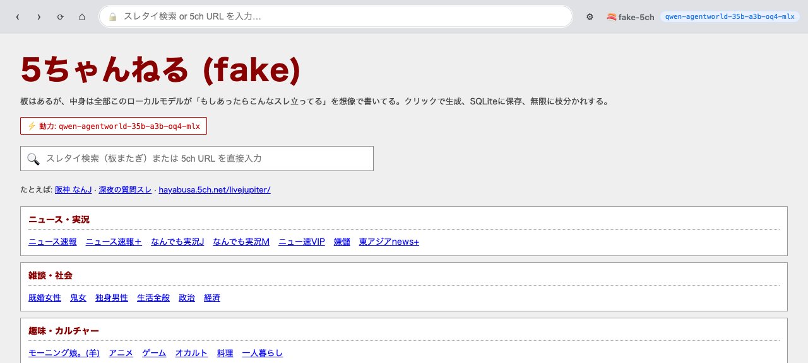

# 🍣 fake-5ch

**5ちゃんねるの形をした匿名掲示板 — 中身は1つもなく、すべてローカルの言語世界モデルがクリックの瞬間に幻覚する。**

> 板をクリック → そのスレ一覧をモデルが書く。スレを開く → 1〜数十レスを書く。スレ内のリンクを踏む → その先のページも書く。何も実在の5chから取ってこない。クリックする度に世界モデルが新しい板の状態を吐き出し、SQLiteに保存され、次に同じURLを開けばまったく同じ内容が返る。



[](LICENSE)
[](https://nodejs.org/)
[](https://arxiv.org/abs/2606.24597)

> English readers: this is the 5ch-flavored Japanese sibling of **[virtual-4chan](https://github.com/tak633b/virtual-4chan)**. Same engine, different board culture. See virtual-4chan's README for the English explanation.

---

## これは何

ローカルで動く 1 つのモデルだけで、丸ごと 5ch を browse できるアプリ。トップページに実在の 5ch 板（なんJ・VIP・ニュー速・嫌儲・モ娘・鬼女・オカルト etc）が並んでて、クリックするとその板のスレ一覧を世界モデルが書き下ろす。スレを開けば 1 から数十レス、AA、半角カナ、>>N アンカー、ID、煽り、自演風連投、コテ — それっぽい 5ch スレが生成される。生成済みは SQLite にキャッシュされ、次回以降は同じ内容で再現される（URL シード）。

**[hanxiao/qwen-agentworld-35b-a3b-web-simulator](https://github.com/hanxiao/qwen-agentworld-35b-a3b-web-simulator)** (Han Xiao 氏「LLM-as-Internet」) のフォーク。あちらは「インターネット全体」を幻覚するが、これは `5ch.net` 系のドメインだけに絞った特化版。`/view` から `rewrite.ts`、SQLite による永続化、設定パネル — 中核のプラミングは全部上流のもの。詳しくは [Lineage](#lineage)。

---

## なぜ動くのか

ありがちな「LLM にロールプレイさせる」系のデモではない。

**[Qwen-AgentWorld-35B-A3B](https://arxiv.org/abs/2606.24597)** はチャットモデルではなく **Language World Model** で、7 ドメインで `(state, action) → next observation` を予測するように訓練されている。そのうちの 1 つが **Web** ドメインで、訓練タスクは文字通り「現在のページとナビゲーション action から、次のブラウザ状態を完全な HTML として予測しろ」。このアプリはそのままそれをやらせる。

結果、ただチャットモデルに「5ch を演じて」と頼むより遥かにコヒーレントに、板・スレ・レス・ID・アンカーの整合性を保ったページが返ってくる。

---

## 仕組み

```
                       ┌─────────────────────────┐
                       │ ユーザーが <a> をクリック  │
                       └────────────┬────────────┘
                                    │
                       ┌────────────▼────────────┐
  /view?url=…&ctx=anchor│      fastify server      │
                       └────────────┬────────────┘
                                    │
                       cache hit ?  ▼
                       ┌──────────────────────────┐
            あり ◄──── │  SQLite (node:sqlite)    │ ──── なし
                       └──────────────────────────┘
                                                  │
                                  ┌───────────────▼──────────────┐
                                  │ prompts.ts がプロンプト生成   │
                                  │ system = "5ch Web World Model"│
                                  │ user   = (url, action,        │
                                  │           page-genre, seed)   │
                                  └───────────────┬──────────────┘
                                                  │
                                  ┌───────────────▼──────────────┐
                                  │ LM Studio OpenAI 互換 API     │
                                  │ qwen-agentworld-35b-a3b       │
                                  │ → HTML を token 単位でstream   │
                                  └───────────────┬──────────────┘
                                                  │
                                  ┌───────────────▼──────────────┐
                                  │ rewrite.ts:                  │
                                  │ ・<script> 除去               │
                                  │ ・画像 → placeholder          │
                                  │ ・全 <a href> を /view?… に  │
                                  │ ・SQLite に保存               │
                                  └───────────────┬──────────────┘
                                                  │
                                  ┌───────────────▼──────────────┐
                                  │ サンドボックス iframe で描画   │
                                  └───────────────────────────────┘
```

- **1モデルで3役。** `/search` は 5ch スレタイ検索（find.5ch.net 相当の JSON 結果）。`/view` は URL をページとして書き下ろす。`rewrite.ts` がすべての `<a href>` を `/view?url=…` に書き換え、anchor text を context として持たせるので、クリックが無限に再帰する。
- **キャッシュ = 世界。** ページは SQLite に永続化。同じ URL は何度開いても同じ内容。世界を一新したければ `world.db` を消す。
- **Thinking モード。** 世界モデルの chain-of-thought 自体がシミュレーション機構だが、ローカル ~30 tok/s でページ予算を食い潰すので既定では assistant prefill で潰してある。`THINKING=on` は精度↑速度↓の honest な opt-in。初回生成は ~2 倍遅くなる、キャッシュ命中は変わらない。

TypeScript ~1100 行、外部依存 2 個（`fastify`、`node-html-parser`）。ビルド工程なし、`tsx` で直接実行。

---

## 起動

### 前提

- **Node 20+**
- **OpenAI 互換のチャットエンドポイント。** 推奨: [LM Studio](https://lmstudio.ai) でモデルブラウザから *"agentworld"* を検索 → `qwen-agentworld-35b-a3b` をダウンロード (4bit なら VRAM ~20GB) → ローカルサーバー ON。

### インストール

```bash
git clone https://github.com/tak633b/fake-5ch.git
cd fake-5ch
npm install
```

### 設定（任意）

デフォルトは LM Studio の既定ポート (`http://127.0.0.1:1234/v1`) を見にいく。違うなら `.env` で上書き。

```bash
cp .env.example .env
# 編集
```

### 起動

```bash
npm run dev          # → http://localhost:3000
```

板を選んでクリック開始。

---

## 他のエンドポイントを使う

ローカルでモデルを動かしてない場合、`⚙ Settings` から OpenAI 互換のどのエンドポイントにも向けられる（Ollama / OpenRouter / OpenAI / 自前サーバー / etc）。再起動不要。

| Provider | Base URL |
|---|---|
| LM Studio (local) | `http://127.0.0.1:1234/v1` |
| Ollama (local) | `http://127.0.0.1:11434/v1` |
| OpenRouter | `https://openrouter.ai/api/v1` |
| OpenAI | `https://api.openai.com/v1` |

ただしページの品質は世界モデル相当のものに依存するので、汎用チャットモデルだと「5ch っぽい」精度が落ちる。

---

## 環境変数

すべて任意。`.env` で上書き可。

| 変数 | デフォルト | 意味 |
|---|---|---|
| `LM_BASE_URL` | `http://127.0.0.1:1234/v1` | OpenAI 互換エンドポイント |
| `MODEL` | `qwen-agentworld-35b-a3b-oq4-mlx` | model id |
| `PORT` | `3000` | HTTP port |
| `DB_PATH` | `./world.db` | 永続化 SQLite |
| `WORLD_EPOCH` | `v1` | bump で新世界（旧ページは旧キーで残存） |
| `THINKING` | `off` | `on` でモデルが考えてから書く（精度↑速度↓） |
| `PAGE_MAX_TOKENS` | `6000` | thinking=off 時のページ予算 |
| `PAGE_MAX_TOKENS_THINK` | `12000` | thinking=on 時の予算 |
| `SERP_MAX_TOKENS` | `2400` | スレタイ検索の予算 |
| `GEN_TIMEOUT_MS` | `240000` | 1 ページの hard ceiling (off) |
| `GEN_TIMEOUT_MS_THINK` | `600000` | 1 ページの hard ceiling (on) |

---

## 同梱の板

トップに以下の実在 5ch 板を並べてある。system prompt は板ごとに口調を仕込んでる（なんJ=野球+J語、VIP=ノリ重視、ニュー速=時事煽り、嫌儲=政治叩き、モ娘=ハロプロ、鬼女=ドロドロ、オカ=怖い系 etc）。

| カテゴリ | 板 |
|---|---|
| **ニュース・実況** | ニュース速報 / ニュース速報＋ / なんでも実況J / なんでも実況M / ニュー速VIP / 嫌儲 / 東アジアnews+ |
| **雑談・社会** | 既婚女性 / 鬼女 / 独身男性 / 生活全般 / 政治 / 経済 |
| **趣味・カルチャー** | モーニング娘。(羊) / アニメ / ゲーム / オカルト / 料理 / 一人暮らし |

アドレスバーに任意の URL を直接入れれば、これ以外の板やスレも生成できる。

---

## エンドポイント

| Method | Path | 何 |
|---|---|---|
| `GET` | `/` | 板一覧 |
| `GET` | `/view?url=…` | キャッシュまたは新規生成したページを描画 |
| `GET` | `/raw?url=…` | iframe に同一オリジンで配るキャッシュ本体 |
| `GET` | `/search?q=…` | スレタイ検索シェル |
| `GET` | `/stream/page?url=…` | SSE: 進捗 + チャンクを stream |
| `GET` | `/stream/search?q=…` | SSE: 検索結果を stream |
| `GET` | `/settings` | エンドポイント / モデル / thinking の設定 |
| `POST` | `/settings` | 設定保存 |
| `GET` | `/health` | モデル ping + world stats |

---

## 注意・ガードレール

これは「もし 5ch にこういうスレがあったら」の架空のレスを生成するもの。system prompt に以下を明記：

- **実在人物への直接的な悪口・名誉毀損は禁止。** 架空の ID・架空のコテで議論させる。
- **暴力の扇動・差別語の使用は避ける。** 5ch 文体の煽りやノリは保つが、加害的なところは外す。
- 出力は LLM 出力なので 100% は保証しない。気持ち悪いページが出たら `world.db` を消せばその「世界」は消える（URL シードなので、同じ URL を再生成すれば同じ内容に戻る）。

公開エンドポイントに向けて他人にブラウズさせる用途は想定してない。**信頼できないエンドポイントと信頼できないユーザーを同時に繋がない。**

---

## 制限

- **速度。** 初回生成は LLM throughput 依存。Mac M シリーズ + 4bit Qwen-AgentWorld で fast モード ~30〜90 秒/ページ、thinking モードで数分。再訪は瞬時。
- **画像は無い。** モデルは `` だけ吐き、`src` はプレースホルダに置換される。5ch なら絵が少ない板も多いので 4chan よりはダメージが少ない。
- **スレ間の共通記憶は無い。** モデルは「別のスレで何があったか」を覚えていない。URL ヒントと link-context だけで世界の連続性を保つ。
- **出力モードの癖。** `THINKING=off` では `<!DOCTYPE html>\n<html lang="ja">` を prefill して即 HTML 出力させる。それでも稀に token cap で truncate するが、パーサがよくあるケースは吸収する。

---

## <a id="lineage"></a>Lineage（出典・系譜）

このアイデアは私が考えたものではない。短く明確な先行系譜がある：

1. **[jina-ai/node-serp](https://github.com/jina-ai/node-serp)** — *LLM-as-SERP* (Jina AI)。「検索結果ページ自体を LLM の幻覚で出したらどうなる？」の元祖デモ。Gemini にプロンプト1発で Google 風 SERP を吐かせる。**核となるアイデアはここから。**

2. **[hanxiao/qwen-agentworld-35b-a3b-web-simulator](https://github.com/hanxiao/qwen-agentworld-35b-a3b-web-simulator)** — *LLM-as-Internet* (Han Xiao)。LLM-as-SERP を拡張して、検索結果のリンクをクリックすると遷移先のページもモデルが書き、そのページ内のリンクもまたクリックすると次のページが生成される — 無限再帰の自己無撞着な Web。さらに、汎用チャットモデルから **Language World Model (Qwen-AgentWorld)** に切り替えた。ページの一貫性が成立するのはこの切り替えのおかげ。**このリポジトリのコードの大半（`/view` ルート、`rewrite.ts`、SQLite-as-world、サンドボックス iframe、ストリーミング、設定パネル）は全部この上流。fork で変えたのは `prompts.ts`、`chrome.ts` のホーム、package メタデータ、README だけ。**

3. **fake-5ch**（このリポジトリ）。同じエンジンを、「インターネット全体」から「5ch.net 系のドメイン1つ」に絞っただけ。やったのは、板ごとの口調 conditioning、板トップ/スレ URL の分類器、5ch 風のホーム、スレタイ検索の framing — それと system prompt のガードレール（実在人物への悪口禁止 etc）。

**気に入ったらまず上流に star を。** 核となる発明はあちら。

## その他の謝辞

- モデル: **Qwen-AgentWorld** — *Language World Models for General Agents* · [arXiv:2606.24597](https://arxiv.org/abs/2606.24597)
- ローカルランタイム: **[LM Studio](https://lmstudio.ai)**
- 英語版兄弟: **[tak633b/virtual-4chan](https://github.com/tak633b/virtual-4chan)** — 同じエンジン、4chan 風

---

## License

[MIT](LICENSE) — 上流と同じ。
